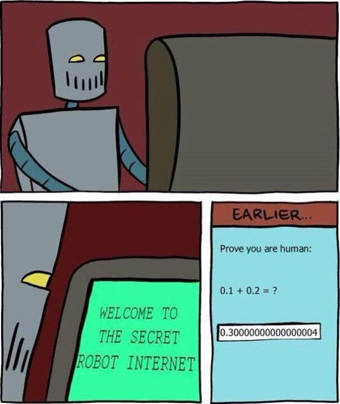

##  Hi~，I'm Barry Zhu. 👋

I'm a passionate web developer from china 🇨🇳. My passion for software lies with dreaming up ideas and making them come true with elegant interfaces. I take great care in the experience, architecture, and code quality of the things I build.

I am also an open-source enthusiast. I learned a lot from the open-source community and I love how collaboration and knowledge sharing happened through open-source.

## Something about me

- 👨‍💻 I'm currently working on my [blog website](https://zhuye.dev), check it out!
- 🖊 I'm participarting in the translation of the new version of React documentation.
- 📚 I'm currently learning three.js.
- ✌️  2021 Goals: Contribute more to Open Source projects.
- ✉️  Reach me at: zhuye256@163.com.

## Languages and tools

<!-- 标签版本 -->

<!-- 纯图标版本 -->

<!-- 

 -->

## Github Stats

## 最新博客(每日0点自动更新)
<!-- BLOG-POST-LIST:START -->
<!-- BLOG-POST-LIST:END -->

## 最新翻译(每日0点自动更新)
<!-- TRANSLATION:START -->
<!-- TRANSLATION:END -->

## 最新视频(每日0点自动更新)
<!-- BILIBILI:START -->
<!-- BILIBILI:END -->